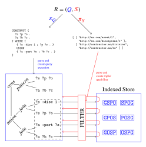

# Strategy

### Regarding Queryable Datastores
While `Bandana` is an implementation of *access control for index cagalogued datastores* on an RDF Triplestore (specifically `Fuseki`[^FUSEKI]), this was mostly forced by circumstance. Still, some considerations:

#### RDF Triplestores
##### Named Graphs and RDF Standards
Triplestores that implement `RDF Dataset` `Named Graphs`[^NG] are a good match as they provide a straightforward way to isolate *datasets* using `Named Graphs` and annotating *datasets* by setting properties on the `Graph Names`[^GN]

###### Common abstract datastructure
Triplestores all use established datastructures (or datastructures with established common abstract features) for indexing and retrieving `triples` or `quads`/`Named Graphs` over large `RDF Datasets`. In the most common vendors, `quads` or `Named Graphs` are stored in 6 fully covering indexes of `quad terms` in varying order.

<table><tr>
<td>

`S`&nbsp;↔&nbsp;`subject`
`P`&nbsp;↔&nbsp;`predicate`
`O`&nbsp;↔&nbsp;`object`
`G`&nbsp;↔&nbsp;`graph`

</td>
<td>

`GSPO`&nbsp;`SPOG`
`GPOS`&nbsp;`POSG`
`GOSP`&nbsp;`OSPG`

</td>
<td>

The indexes themselves might be nested hashtables, BTrees or other appropriate datastructures. `Fuseki` uses *B+Trees*[^jenaBPT][^wikiBPT] for its persistent triplestore storage `TDB2`[^TDB2] which `Bandana` targets.

</td>
</tr></table>

For the [injective range function](theory.md/#range-functions) and an *access policy* consisting of $n$ *scopes*, this entails making $n$ fully indexed lookups for each `Named Graph` (i.e. `record`) $g$ accessed during query evaluation. Since the lookup is fully indexed, it does not matter which of the indexes is used.

To compute the *surjective range function*, a single lookup pr. `Named Graph` on the three first keys in the `GSPO` index will retreive all the *terms* that have to be in the *access policy* to grant access.

###### Standards convergence
In addition, there is a growing convergence in various RDF libraries and triplestore distributions around the use of common interfaces for low-level access to RDF data. `Graph`[^rdfGRAPH][^jenaGRAPH], `Dataset`[^rdfjsDATASET][^jenaDATASET] and in particular the `match`[^rdfMATCH][^rdfjsMATCH][^jenaMATCH] functional interface for indexed access to triples/quads is used by the query-engine of many triplestore vendors (including [^FUSEKI]). An implementation strategy at this level will likely enjoy a high degree of portability.

##### Bandana triplestore strategy

`Bandanas` chosen strategy of overriding/intercepting `match` and filtering `quads` directly returned from the indexed RDF datastructure can be applied both  to `Graph Store HTTP Protocol`[^GSP] and `SPARQL Query Protocol`[^SQP] endpoints by providing the same underlying `RDF Dataset` to both. 

###### Related work

Future planned work included an extension to `SPARQL` for querying against views calculated from a set of *scopes*[^SCO] according to the [injective range function](theory.md#range-functions). `Bandana` not only covers a large part of this problem space, but can be directly composed with such extensions without interference.

##### Query rewriting
An alternative approach of *query rewriting* was considered, as this would allow us to sidestep interacting with the triplestore implementation alltogether. Main takeaways:
- All of `SPARQL Algebra`[^ALG] and `SPARQL Query Protocol`[^SQP] semantics must be interpreted in relation to [Access Control for Index-Catalogued Datastores](theory.md). 
  - Large surface area ⟶ large risk for security bugs 
- `Property Path` pattern queries accross `Named Graphs` using the *Union Graph* cannot be securely rewritten as it produces binding patterns that cannot be matched against patterns in accessible `Named Graphs`.
  - Alternatives:
    - Disable `Property Path` patterns in the *Union Graph*
    - Accept security leaks for queries of this type (lol)
  - While it might seem like a rare corner case, we rely heavily on this combination of features to properly query against composite datasets in the *Record Ontology*[^RO]
- Performance-wise this method will require that every visited named-graph be checked for access *in the query itself*, which has performance implications: 
  - no control of caching (the same `Named Graph` may be checed for access multiple times during a query evaluation)
  - necessarily increased query complexity (all the access checks have to be added, nothing is removed)
    - while the added access checks in theory only increase the search space for query evaluation by a constant factor of about 2, injecting these patterns inside or after every `GRAPH` statement is likely to affect various query optimization strategies (i.e. query plans) implemented by the triplestore server.

#### A Diagram

### Authentication
PoC a minimal cryptographic authentication of requests using JWT/JWS

### Technology choices
- Use `Fuseki` triplestore
  - free
  - extensible
    - in particular, has extensibility API's for access control
  - already used in splinter
  - Query rewriting complex in comparison to base api 

[^RO]:*Record Ontology* https://github.com/equinor/records
[^FUSEKI]: *Apache Jena Fuseki* https://jena.apache.org/documentation/fuseki2/
[^NG]: *RDF Datasets* https://www.w3.org/TR/rdf11-concepts/#h2_section-dataset
[^jenaBPT]: *BPlusTree.java* https://github.com/apache/jena/blob/main/jena-db/jena-dboe-trans-data/src/main/java/org/apache/jena/dboe/trans/bplustree/BPlusTree.java
[^wikiBPT]: *B+ tree* (Wikipedia) https://en.wikipedia.org/wiki/B%2B_tree
[^TDB2]: `TDB2` https://jena.apache.org/documentation/tdb2/
[^GN]: See https://www.w3.org/TR/rdf11-datasets/#the-graph-name-denotes-the-named-graph-or-the-graph for some discussion about the semantic implication of this. In particular, the last paragraph of section 3.3.3
[^rdfGRAPH]: `Graph` as a *W3C Recommendation* https://www.w3.org/TR/rdf-interfaces/#graphs
[^jenaGRAPH]: `Graph` as implemented by `Jena` https://jena.apache.org/documentation/javadoc/jena/org.apache.jena.core/org/apache/jena/graph/Graph.html
[^rdfjsDATASET]: `Dataset` as defined by *RDFJS* https://rdf.js.org/dataset-spec/#datasetcore-interface
[^jenaDATASET]: `Dataset` as implemented by `Jena` https://jena.apache.org/documentation/javadoc/arq/org.apache.jena.arq/org/apache/jena/sparql/core/DatasetGraph.html
[^rdfMATCH]: `match` as a *W3C Recommendation* https://www.w3.org/TR/rdf-interfaces/#widl-Graph-match-Graph-any-subject-any-predicate-any-object-unsigned-long-limit
[^rdfjsMATCH]: `match` as defined by *RDFJS* https://rdf.js.org/dataset-spec/#dom-datasetcore-match
[^jenaMATCH]: `match` as implemented by `Jena` https://jena.apache.org/documentation/javadoc/arq/org.apache.jena.arq/org/apache/jena/sparql/core/DatasetGraph.html#find(org.apache.jena.graph.Node,org.apache.jena.graph.Node,org.apache.jena.graph.Node,org.apache.jena.graph.Node)
[^ALG]: *SparQL Algebra* https://www.w3.org/TR/sparql11-query/#sparqlAlgebra
[^GSP]: *Graph Store HTTP Protocol* https://www.w3.org/TR/sparql11-http-rdf-update/
[^SCO]: `isInScope` (*RDF Predicate https://rdf.equinor.com/ontology/record/isInScope*)  
	A "Scope" is a set of (references to) business concepts/topics. As a topic it is interpreted as the *intersection* of  the referenced topics. 

[^SQP]: *SPARQL Query Protocol* https://www.w3.org/TR/sparql11-protocol/